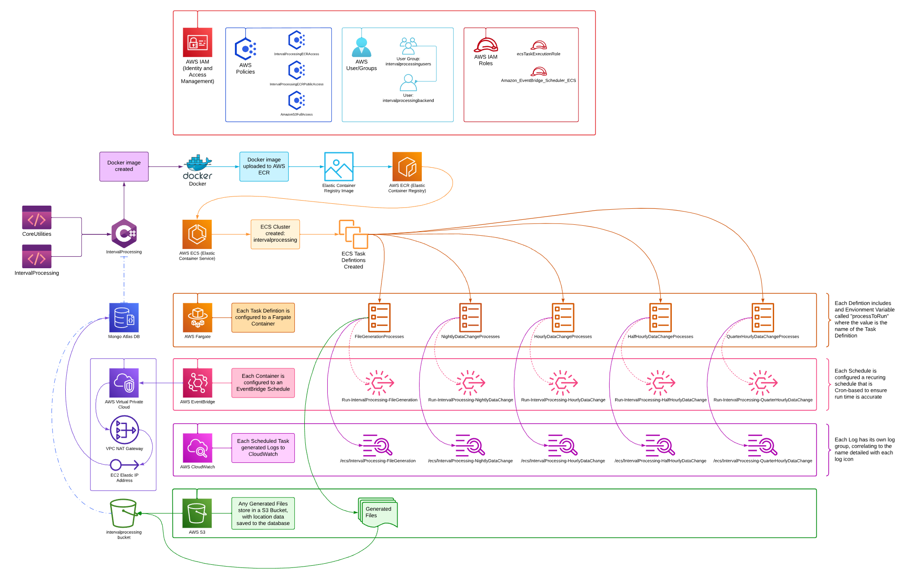

# AWS Architecture Documentation

Below are detailed instructions on how to create and configure each step involved in the AWS Architecture of this project. You will use Docker, VPC, ECR, ECS, Fargate, S3, EventBridge, CloudWatch, and IAM to bring life to the serverless execution of this application. Note that all of this is configured for the free tier of AWS, meaning that everything is public. If you desire to create private repositories, you will find that most of the instructions still apply, save for a few bits in the Docker related portion. 

These instructions are arranged in an order that flows sequentially, so you should not be configuring/creating any element that relies on a piece that you have yet to create. This will hopefully lend itself to a smooth implementation for you.

## The System Design Diagram (current version):



## VPC Configuration

- **VPC Instructions:**
    - Navigate to **AWS VPC (Virtual Private Cloud)**, click your default VPC.
- **Subnet Instructions:**
    - Navigate to **Subnets**, click `Create subnet`
        - **VPC ID**: select your VPC
        - **Subnet settings**:
            - **Subnet name**: private-subnet-intervalprocessing
            - **Availibility Zone**: select us-east-1a
            - **IPv4 subnet CIDR block**: enter a value that works for you
- **NAT Gateway Instructions:**
    - Navigate to **NAT gateway**, click `Create NAT gateway`
        - **Name**: interval-processing-gateway
        - **Subnet**: Select `private-subnet-intervalprocessing`
        - **Connectivity type**: Public
        - **Elastic IP allocation ID**: click `Allocate Elastic IP`
- **Route Table Instructions:**
    - Navigate to **Route tables**, click `Create route table`
        - **Name**: interval-processing-route-table-01
        - **VPC**: Select your VPC
        - Click `Create route table`
    - Navigate to `Routes` after selecting your new route table, click `Edit routes`
        - For the Destination of 0.0.0.0/0:
            - **Target**: NAT Gateway
            - click `nat-` in the box below and select the NAT Gatway created above.
            - click Save changes

- Your VPC, when viewing `Resource map`, should show your private subnet (`private-subnet-intervalprocessing`) routing through your created route table (`interval-processing-route-table-01`) to your NAT Gateway (`interval-processing-gateway`).

- Your Elastic IP address, located in **Elastic IPs**, can be copied to whitelist into your mongo atlas database, under Network Access in your atlas cluster. You will need to do this for the AWS task to be able to communicate with your mongo database.

## S3 Bucket

- **Bucket Name:** `intervalprocessing`
  - Used for storing output files and logs.
- **Instructions:**
    1. Navigate to **AWS S3**, click `Create bucket`
    2. Select the following:
        - **Region**: us-east-1
        - **Bucket type**: General purpose
        - **Bucket name**: intervalprocessing
        - **Object Ownership**: ACLs disabled
        - **Block Public Access settings for this bucket**: Uncheck, then check the acknowledgement
        - **Bucket Versioning**: Disabled
        - **Default Encryption**: Server-side encryption with Amazon S3 managed keys (SSE-S3)
        - **Bucket Key**: Enabled
    3. Create folder: `GeneratedFiles`


## ECR: Docker Image Management

- **ECR Instructions:**
    1. Navigate to **AWS ECR (Elastic Container Registry)**, click `Create repository`
    2. Select the following:
        - **Visibility Settings**: Public
        - **Detail name**: intervalprocessing
        - Leave the remaining optional settings alone
    3. **AWS ECR** will store Docker images here

- **Docker Image Instructions:**
  1. **Code Changes** - Update or modify application code as needed.
  2. **Build Docker Image** - the Dockerfile at the root of csharp-examples will handle image building. In your terminal/bash, navigate to the directory with the Dockerfile and run:
     ```shell
     docker build -t intervalprocessing .
     ```
  3. **Tag the Docker Image**
     ```shell
     docker tag intervalprocessing:latest public.ecr.aws/z3p4q4u7/intervalprocessing:latest
     ```
  4. **Authenticate AWS with Docker**
     ```shell
     aws ecr-public get-login-password --region us-east-1 | docker login --username AWS --password-stdin <your-ecr-repository-URI>
     ```
     - Replace `<your-ecr-repository-URI>` with the **URI** on the ECR Repo
     - If encountering errors with saving credentials, navigate to `C:/Users/<Your Username>/.docker/config.json` and remove the `credStore` key, then retry.
  5. **Push Image to AWS ECR**
     ```shell
     docker push <your-ecr-repository-URI>:latest
     ```
     - Again, replace `<your-ecr-repository-URI>` with your **ECR** **URI**
  6. Confirm the image uploaded to **AWS ECR**

## ECS: Container Management, Task Definitions
- **ECS Instructions:**
    1. Navigate to **AWS ECS (Elastic Container Service)**, click `Create cluster`
    2. Select the following:
        - **Cluster name**: intervalprocessing
        - **Default namespace**: leave blank
        - **Infrastructure**: Check AWS Fatgate (serverless)
        - Leave the remaining optional settings alone
    3. **AWS ECS** will store Task Definitions here
- **Creating Task Definitions:**
    1. Navigate to `Task Definitions` inside of **ESC**, click `Create new task definition`
    2. You will need to create a task definition for each of the following:
        1. **FileGeneration**
        2. **NightlyDataChange**
        3. **HourlyDataChange**
        4. **HalfHourlyDataChange**
        5. **QuarterHourlyDataChange**
    2. Select the following:
        - **Task definition family**: `IntervalProcessing-<Process>`, where `<Process>` is the name of the process the task definition is for, e.g.: `IntervalProcessing-FileGeneration`
        - **Infrastructure requirements**:
            - **Launch type**: check `AWS Fargate`
            - **Operating system/Architecture**: Select Linux/X86_64
            - **network mode**: will default to awsvpc
            - **CPU**: 1 vCPU
            - **Memory**: 3 GB
            - **Task role**: None
            - **Task execution role**: Select `ecsTaskExecutionRole`
            - Leave the remaining optional settings alone
        - **Container-1**:
            - **Name**: `intervalprocessing-<process>`, where `<process>` is the lowercased name of the process the task definition is for, e.g.: `intervalprocessing-filegeneration`
            - **Image URI**: Select the image URI from ECR
            - **Essential Container**: Yes
            - **Private registry authentication**: no
            - **Port mappings**: leave 80, click Add port mapping
                - **Container port**: 27017
                - **Protocol**: Select TCP
                - Leave the remaining settings alone
            - **Environment Variables**: Click Add environment variable
                - **Key**: processToRun
                - **Value type**: select Value
                - **Value**: Switch Key from IntervalProcessing Program.cs that matches the task defintion, e.g.: `FileGenerationProcesses`
                - Switch for reference:
                    ```csharp
                    switch (processToRunKey)
                    {
                        case "FileGenerationProcesses":
                            ConfigureFileGenerationServices(serviceCollection);
                            break;
                        case "NightlyDataChangeProcesses":
                        case "HourlyDataChangeProcesses":
                        case "HalfHourlyDataChangeProcesses":
                        case "QuarterHourlyDataChangeProcesses":
                            ConfigureDataChangeServices(serviceCollection);
                            break;
                        default:
                            throw new NotImplementedException();
                    }
                    ```
            - **Logging**: Click Use log collection
                - select **Amazon CloudWatch**
                - default values should work, but ensure aswlogs-group Value is `/ecs/<name-of-task-defintion>`, e.g.: `/ecs/IntervalProcessing-FileGeneration`
            - **Storage**:
                - **Ephemoral storage Amount**: 21
        - Click `Create`, then repeat this process until there is 1 Task Defintion for each process listed above.

## IAM: Users, User Groups, Policies

- Creation of IAM users and user groups to manage permissions.
    1. User Groups: Create `intervalprocessingusers`
    2. User: Create `intervalprocessingbackend` user, assign `intervalprocessingusers` as User Group
- Defining IAM policies to control access to AWS resources.
    1. Add `AmazonS3FullAccess` Policy to `intervalprocessingusers` User Group
    2. Create policy: `IntervalProcessingECRAccess`
        ```json
        {
            "Version": "2012-10-17",
            "Statement": [
                {
                    "Action": [
                        "ecr:BatchCheckLayerAvailability",
                        "ecr:BatchGetImage",
                        "ecr:CompleteLayerUpload",
                        "ecr:GetDownloadUrlForLayer",
                        "ecr:InitiateLayerUpload",
                        "ecr:PutImage",
                        "ecr:UploadLayerPart"
                    ],
                    "Effect": "Allow",
                    "Resource": "arn:aws:ecr:us-east-1:<Your Account ID>:repository/intervalprocessing"
                },
                {
                    "Action": [
                        "ecr:GetAuthorizationToken",
                        "ecr-public:GetAuthorizationToken",
                        "sts:GetServiceBearerToken"
                    ],
                    "Effect": "Allow",
                    "Resource": "*"
                }
            ]
        }
        ```
    3. Replace `<Your Account ID>` in the Statement.Resource value with your AWS Account ID
    4. Create Policy: `IntervalProcessingECRPublicAccess`
        ```json
        {
            "Version": "2012-10-17",
            "Statement": [
                {
                    "Effect": "Allow",
                    "Action": [
                        "ecr-public:GetAuthorizationToken",
                        "ecr-public:BatchCheckLayerAvailability",
                        "ecr-public:InitiateLayerUpload",
                        "ecr-public:UploadLayerPart",
                        "ecr-public:CompleteLayerUpload",
                        "ecr-public:PutImage"
                    ],
                    "Resource": "*"
                }
            ]
        }
        ```
    5. Assign both `IntervalProcessingECRAccess` and `IntervalProcessingECRPublicAccess` to the `intervalprocessingusers` User Group.

## EventBridge: Schedule Tasks, Run Containers
- **EventBridge Instructions:**
    - Navigate to **AWS EventBridge**.
    - Navigate to `Schedules`, click `Create schedule`
        - **Schedule name and description**:
            - **Schedule name**: `Run-IntervalProcessing-<Process>`, where `<Process>` is the name of the process the task definition is for, e.g.: `Run-IntervalProcessing-FileGeneration`
            - **Description**: give whatever detail you like
        - **Schedule pattern**:
            - **Occurrence**: Recurring schedule
            - **Time zone**: your timezone
            - **Schedule type**: Cron-based schedule
            - **Cron expression**: whatever is relevant to the process:
                ```js
                cron(0 2 * * ? *) //nightly at 2am
                cron(0 * * * ? *) //hourly
                cron(0/30 * * * ? *) //half hourly
                cron(0/15 * * * ? *) //quarter hourly
                ```
            - **Flexible time window**: Off
        - **Target detail**:
            - select `Amazon ECS RunTask`
        - **RunTask**:
            - **ECS cluster**: select your intervalprocessing esc cluster
            - **ECS task**: select your task from your created Task Definitions
            - check Latest
            - **Task count**: 1
            - **Compute Options**:
                - select Capacity provider strategy
                - select Use custom
                - **Base**: blank
                - **Capacity provider**: select FARGATE
                - **Weight**: 1
            - **Configure Network Configuration**:
                - **Subnets**: enter your private subnet id, e.g.: `subnet-0123ab45678cd9`
                - **Security groups**: enter your security group id, e.g.: `sg-01ab2cd34e5678ff9`
                - **Auto-assign Public IP**: leave blank
        - **Schedule state**:
            - Enable schedule: no, you can enable them later when you are ready for them to run.
        - **Action after schedule completion**: select NONE
        - **Retry policy and dead-letter queue (DLQ)**:
            - select whatever values you want, but do not exceed the time limit of the processes scheduled interval, for example, dont have the 15 minute process retry for 2 hours. Retry attemps recommendation is 3, with None for the Dead-letter queue (DLQ)
        - **Permissions**:
            - **Execution Role**: select `Create new role for this schedule`
            - you can change the name if you like, e.g.: `Amazon_EventBridge_Scheduler_ECS_FileGeneration`
            - save the schedule
    - Create 1 Schedule for each Task Defintion until complete.

## Test the Fargate Process
- Navigate back to **AWS ECS**, to `Task Defintions`, select any task you want to test, and then choose to `Deploy -> Run Task`. Ensure the tasks complete, and review the logs for them in **AWS CloudWatch**. If successful, enable your schedules that you are ready to run in **AWS EventBridge**, and congratulations, you have completed this AWS Architected System!
